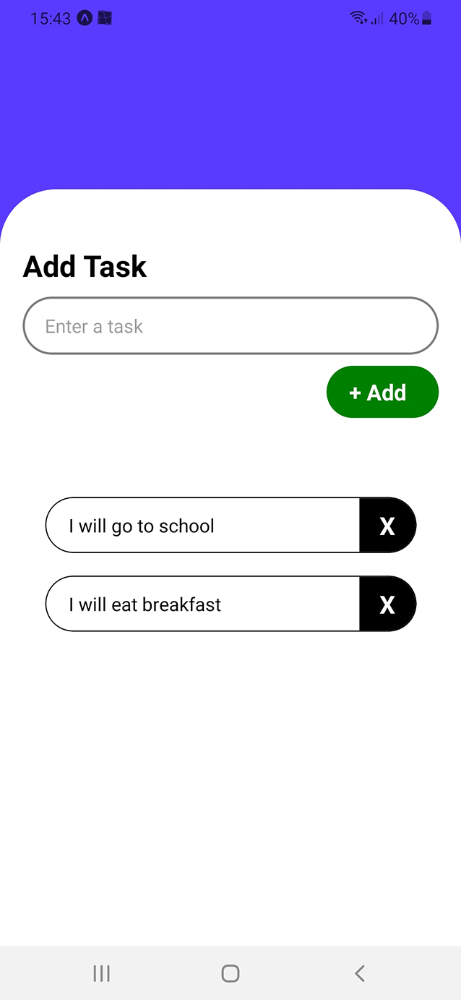

# Todo-App

This is a simple Todo App built using React Native and Expo. It allows users to add and remove tasks to manage their daily activities.

## Features

- Add tasks to a task list.
- Delete tasks from the list.
- Scrollable task list view for better task management.

## Technologies

- [React Native](https://reactnative.dev/)
- [Expo](https://expo.dev/)

## Getting Started

### Prerequisites

- [Node.js](https://nodejs.org/en/)
- [Expo CLI](https://docs.expo.dev/get-started/installation/)

### Installation

1. Clone the repository:

   ```bash
   git clone https://github.com/AnasMaiza01/todo-app.git
   cd todo-app
   ```
2. Install dependencies:

   ```bash
   npm install
   ```
3. Start the Expo server:

   ```bash
   npm start
   ```

### Running on a Device/Simulator

- Run the app on an Android or iOS device using the Expo Go app or a simulator/emulator.
  ```bash
  npx expo start
  ```

  Follow the instructions in the terminal to open the app on your device.

## Code Explanation

The app consists of a simple task management system:

- **State Management**: Two state variables `task` and `tasks` are used to track the current input and the list of tasks respectively.
- **Add Task**: The `add()` function is used to append new tasks to the list.
- **Delete Task**: The `deleteTask()` function removes a task based on its index.
- **Task Rendering**: The tasks are displayed using a `ScrollView`, with each task being rendered as a list item, along with a delete button.

### Main Functions

- `add()`: Adds the input task to the list.
- `deleteTask(index)`: Deletes the task at the specified index.

## Screenshot



## License

This project is licensed under the MIT License.
